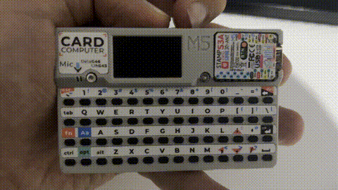

# CardPortal 🚪📡

CardPortal is a **captive portal project for the M5Stack Cardputer**.  
It provides a retro-style UI to configure Wi-Fi SSID, password, and select HTML files from the SD card to serve as portal content.

---



---

## ✨ Features
- Retro intro screen with glitch-style logo
- Multi-state navigation:
  - **PRESS** → start screen
  - **ENTER_SSID** → input Wi-Fi SSID
  - **ENTER_PASS** → input Wi-Fi password
  - **SELECT_HTML** → choose an HTML file from SD card
- SD card integration:
  - Store and retrieve Wi-Fi credentials
  - Save captive portal HTML templates
  - Dynamically list available `.html` files
- Custom fonts (PressStart2P retro style)
- Canvas-based drawing to minimize flicker

---

## 📂 Project Structure
```
CardPortal/
│── src/
│   ├── main.cpp        # Entry point
│   ├── intro.cpp       # Intro animation & logo
│   ├── menu.cpp        # Menu system & state machine
│   ├── evil_portal.cpp # Captive portal server logic
│
│── include/
│   └── menu.h
│
│── platformio.ini      # PlatformIO configuration
```

---

## 🖼️ Screenshots / Preview
*(Screenshots to be added once running on device)*

- Start Screen → "Press to Start"
- SSID & Password entry with blinking cursor
- HTML selection menu

---

## ⚙️ Requirements
- **Hardware**:  
  - M5Stack Cardputer
  - MicroSD card
- **Software**:  
  - [PlatformIO](https://platformio.org/)  
  - Arduino framework  
  - Libraries:
    - `M5Unified`
    - `M5Cardputer`
    - `M5GFX`
    - `AsyncTCP`
    - `ESPAsyncWebServer`

---

## 🚀 Getting Started

1. Clone this repository:
   ```bash
   git clone https://github.com/yourusername/CardPortal.git
   cd CardPortal
   ```

2. Install dependencies (PlatformIO will handle most automatically via `platformio.ini`).

3. Build & upload to your Cardputer:
   ```bash
   pio run --target upload
   ```

4. Insert SD card with `.html` files in the root directory. Example files included:
   - `login.html`
   - `survey.html`
   - `notice.html`
   - `welcome.html`

5. Start device → navigate the UI → select SSID, password, and HTML file.

---


## 📜 License
MIT License © 2025 Ulaş Sakın
